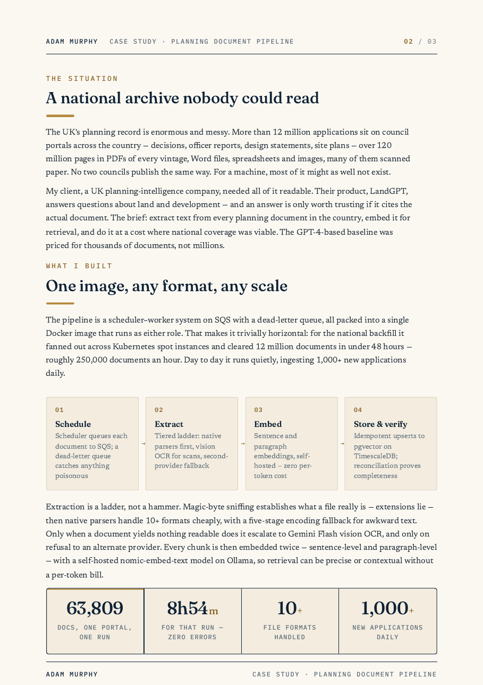
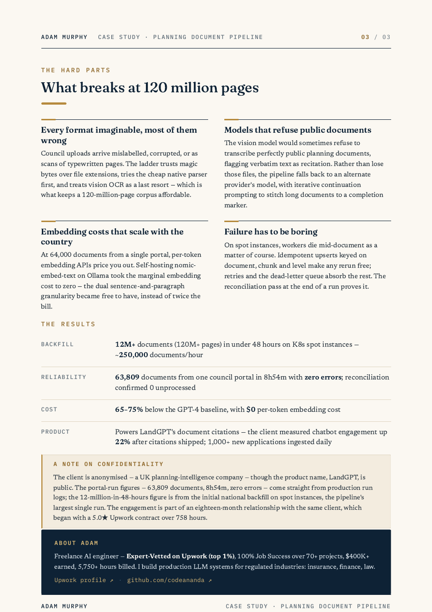

# Twelve million planning documents, made searchable

**One Docker image, horizontally scaled on spot instances, turned the UK's 12 million planning documents — over 120 million pages — into clean text and embeddings in under 48 hours, at 65–75% below the GPT-4 baseline cost.**

## At a glance

| Value | What it is |
|---|---|
| 12M+ | Documents in 48 hours |
| 0 | Errors, 63,809-doc portal run |
| $0 | Per-token embedding cost |
| 250k | Documents per hour |

## The situation

The UK's planning record is enormous and messy. More than 12 million applications sit on council portals across the country — decisions, officer reports, design statements, site plans — over 120 million pages in PDFs of every vintage, Word files, spreadsheets and images, many of them scanned paper. No two councils publish the same way. For a machine, most of it might as well not exist.

My client, a UK planning-intelligence company, needed all of it readable. Their product, LandGPT, answers questions about land and development — and an answer is only worth trusting if it cites the actual document.

The brief: extract text from every planning document in the country, embed it for retrieval, and do it at a cost where national coverage was viable. The GPT-4-based baseline was priced for thousands of documents, not millions.

## What I built

The pipeline is a scheduler–worker system on SQS with a dead-letter queue, all packed into a single Docker image that runs as either role. That makes it trivially horizontal: for the national backfill it fanned out across Kubernetes spot instances and cleared 12 million documents in under 48 hours — roughly 250,000 documents an hour. Day to day it runs quietly, ingesting 1,000+ new applications daily.

| Step | What happens |
|---|---|
| Schedule | Scheduler queues each document to SQS; a dead-letter queue catches anything poisonous |
| Extract | Tiered ladder: native parsers first, vision OCR for scans, second-provider fallback |
| Embed | Sentence and paragraph embeddings, self-hosted — zero per-token cost |
| Store & verify | Idempotent upserts to pgvector on TimescaleDB; reconciliation proves completeness |

Extraction is a ladder, not a hammer. Magic-byte sniffing establishes what a file really is — extensions lie — then native parsers handle 10+ formats cheaply, with a five-stage encoding fallback for awkward text. Only when a document yields nothing readable does it escalate to Gemini Flash vision OCR, and only on refusal to an alternate provider.

Every chunk is then embedded twice — sentence-level and paragraph-level — with a self-hosted nomic-embed-text model on Ollama, so retrieval can be precise or contextual without a per-token bill.

## The hard parts

### Every format imaginable, most of them wrong

Council uploads arrive mislabelled, corrupted, or as scans of typewritten pages. The ladder trusts magic bytes over file extensions, tries the cheap native parser first, and treats vision OCR as a last resort — which is what keeps a 120-million-page corpus affordable.

### Models that refuse public documents

The vision model would sometimes refuse to transcribe perfectly public planning documents, flagging verbatim text as recitation. Rather than lose those files, the pipeline falls back to an alternate provider's model, with iterative continuation prompting to stitch long documents to a completion marker.

### Embedding costs that scale with the country

At 64,000 documents from a single portal, per-token embedding APIs price you out. Self-hosting nomic-embed-text on Ollama took the marginal embedding cost to zero — the dual sentence-and-paragraph granularity became free to have, instead of twice the bill.

### Failure has to be boring

On spot instances, workers die mid-document as a matter of course. Idempotent upserts keyed on document, chunk and level make any rerun free; retries and the dead-letter queue absorb the rest. The reconciliation pass at the end of a run proves it.

## Results

| Area | Outcome |
|---|---|
| Backfill | 12M+ documents (120M+ pages) in under 48 hours on K8s spot instances — ~250,000 documents/hour |
| Reliability | 63,809 documents from one council portal in 8h54m with zero errors; reconciliation confirmed 0 unprocessed |
| Cost | 65–75% below the GPT-4 baseline, with $0 per-token embedding cost |
| Product | Powers LandGPT's document citations — the client measured chatbot engagement up 22% after citations shipped; 1,000+ new applications ingested daily |

## A note on confidentiality

The client is anonymised — a UK planning-intelligence company — though the product name, LandGPT, is public. The portal-run figures — 63,809 documents, 8h54m, zero errors — come straight from production run logs; the 12-million-in-48-hours figure is from the initial national backfill on spot instances, the pipeline's largest single run. The engagement is part of an eighteen-month relationship with the same client, which began with a 5.0★ Upwork contract over 758 hours.

## The full case study

A designed PDF version of this case study is in this repo: [08-planning-doc-pipeline.pdf](08-planning-doc-pipeline.pdf).

---

## About Adam

Freelance AI engineer — Expert-Vetted on Upwork (top 1%), 100% Job Success over 70+ projects, $400K+ earned, 5,750+ hours billed. I build production LLM systems for regulated industries: insurance, finance, law.

- [Upwork profile](https://www.upwork.com/freelancers/~01153ca9fd0099730e)
- [GitHub](https://github.com/codeananda)
